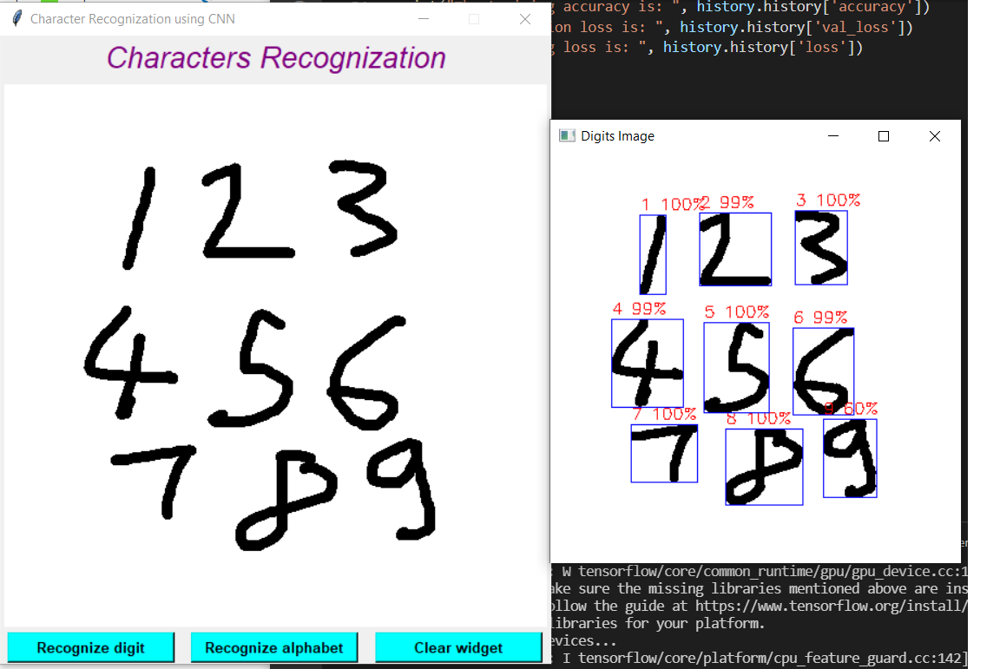
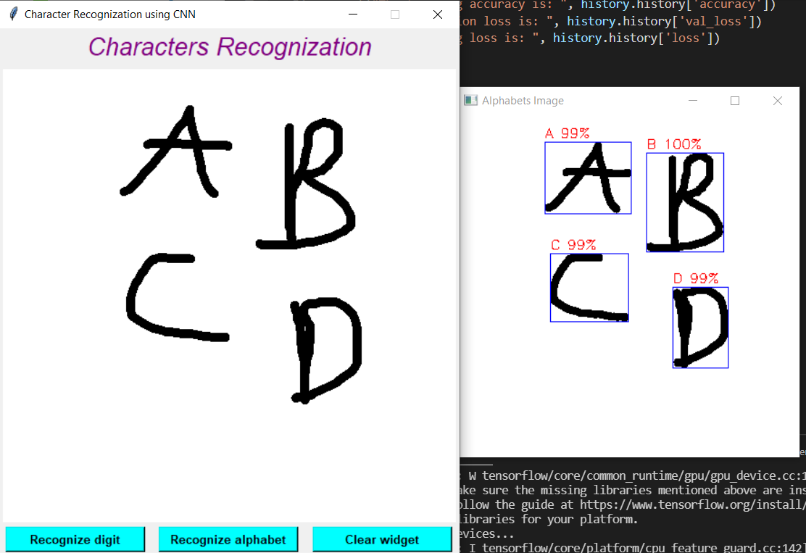

# characters_recognization_tkinter
The user draws a character and the app predicts what that character is.

### You need to download ghostscript via 

- https://www.ghostscript.com/releases/gsdnld.html
- and then change the version of ghostscript you just downloaded into the code below.

- gui.py

- **from PIL import EpsImagePlugin**

- **EpsImagePlugin.gs_windows_binary = r'C:\Program Files\gs\gs9.55.0\bin\gswin64c'**

### Install the necessary libraries
- pip install requirements.txt

